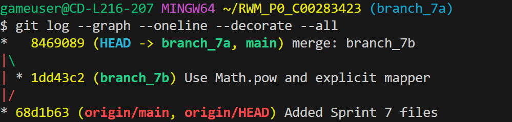

gameuser@CD-L216-207 MINGW64 ~/RWM_P0_C00283423 (main)
$ git checkout -b branch_7a
Switched to a new branch 'branch_7a'

gameuser@CD-L216-207 MINGW64 ~/RWM_P0_C00283423 (branch_7a)
$ git commit -am "Use Exponent operator for cube"
[branch_7a 5fad7b4] Use Exponent operator for cube
1 file changed, 1 insertion(+), 1 deletion(-)

gameuser@CD-L216-207 MINGW64 ~/RWM_P0_C00283423 (branch_7a)
$ git checkout main
Switched to branch 'main'
Your branch is up to date with 'origin/main'.

gameuser@CD-L216-207 MINGW64 ~/RWM_P0_C00283423 (main)
$ git checkout -b branch_7b
Switched to a new branch 'branch_7b'

gameuser@CD-L216-207 MINGW64 ~/RWM_P0_C00283423 (branch_7b)
$ git commit -am "Use Math.pow and explicit mapper"
[branch_7b 1dd43c2] Use Math.pow and explicit mapper
1 file changed, 2 insertions(+), 2 deletions(-)

gameuser@CD-L216-207 MINGW64 ~/RWM_P0_C00283423 (branch_7b)
$ git log
commit 1dd43c2bbc247b12cc9448d7f5520ab71d7578c9 (HEAD -> branch_7b)
Author: Ryan Holloway <C00283423@setu.ie>
Date: Mon Oct 13 10:43:06 2025 +0100

    Use Math.pow and explicit mapper

commit 68d1b63a443d22c49a517fdc240d6ccf44ce2d30 (origin/main, origin/HEAD, main)
Author: Ryan Holloway <C00283423@setu.ie>
Date: Mon Oct 13 09:49:25 2025 +0100

    Added Sprint 7 files

gameuser@CD-L216-207 MINGW64 ~/RWM_P0_C00283423 (branch_7b)
$ git checkout main
Switched to branch 'main'
Your branch is up to date with 'origin/main'.

gameuser@CD-L216-207 MINGW64 ~/RWM_P0_C00283423 (main)
$ git merge --no-ff branch_7b -m "merge: branch_7b"
Merge made by the 'ort' strategy.
Sprint 7/src/lib/filters/cube.ts | 4 ++--
1 file changed, 2 insertions(+), 2 deletions(-)

gameuser@CD-L216-207 MINGW64 ~/RWM_P0_C00283423 (main)
$ git checkout branch_7a
Switched to branch 'branch_7a'

gameuser@CD-L216-207 MINGW64 ~/RWM_P0_C00283423 (branch_7a)
$ git rebase -i main
Auto-merging Sprint 7/src/lib/filters/cube.ts
CONFLICT (content): Merge conflict in Sprint 7/src/lib/filters/cube.ts
error: could not apply 5fad7b4... Use Exponent operator for cube
hint: Resolve all conflicts manually, mark them as resolved with
hint: "git add/rm <conflicted_files>", then run "git rebase --continue".
hint: You can instead skip this commit: run "git rebase --skip".
hint: To abort and get back to the state before "git rebase", run "git rebase --abort".
hint: Disable this message with "git config set advice.mergeConflict false"
Could not apply 5fad7b4... # Use Exponent operator for cube

gameuser@CD-L216-207 MINGW64 ~/RWM_P0_C00283423 (branch_7a|REBASE 1/1)
$ git add .

gameuser@CD-L216-207 MINGW64 ~/RWM_P0_C00283423 (branch_7a|REBASE 1/1)
$ git rebase --continue
Successfully rebased and updated refs/heads/branch_7a.

gameuser@CD-L216-207 MINGW64 ~/RWM_P0_C00283423 (branch_7a)
$

